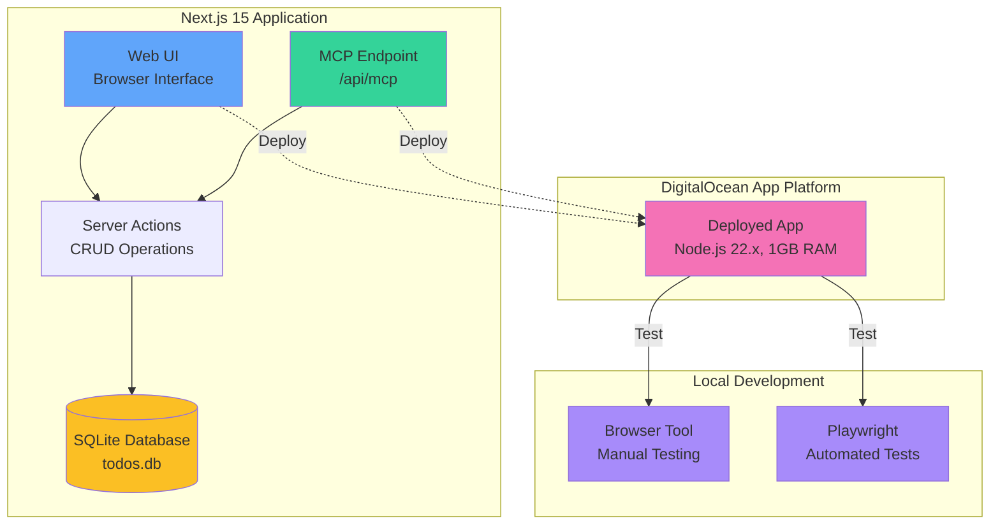

# Next.js 15 Todo App with MCP Integration

A modern, full-stack todo application built with Next.js 15, featuring Server Actions, SQLite database, and Model Context Protocol (MCP) endpoint integration for AI assistant access.

## 🏗️ Architecture



## ✨ Features

- ✅ **Modern UI**: Beautiful, responsive interface built with Tailwind CSS
- ✅ **Server Actions**: Next.js 15 Server Actions for seamless data mutations
- ✅ **SQLite Database**: Lightweight, persistent storage with better-sqlite3
- ✅ **MCP Endpoint**: AI-accessible interface for programmatic todo management (Coming in V2)
- ✅ **Real-time Updates**: Automatic revalidation after data changes
- ✅ **Type Safety**: Full TypeScript support throughout the application

## 🚀 Getting Started

### Prerequisites

- Node.js 22.x or later
- npm or yarn

### Installation

1. Clone the repository:
```bash
git clone https://github.com/YOUR_USERNAME/next15-todo-mcp.git
cd next15-todo-mcp
```

2. Install dependencies:
```bash
npm install
```

3. Run the development server:
```bash
npm run dev
```

4. Open [http://localhost:3000](http://localhost:3000) in your browser.

## 📁 Project Structure

```
next15-todo-mcp/
├── app/
│   ├── actions/
│   │   └── todos.ts          # Server Actions for CRUD operations
│   ├── api/
│   │   └── mcp/
│   │       └── route.ts      # MCP endpoint (V2)
│   ├── page.tsx              # Main todo list UI
│   └── layout.tsx            # Root layout
├── lib/
│   └── db.ts                 # SQLite database setup
├── tests/
│   └── mcp.spec.ts           # Playwright MCP tests (V3)
├── todos.db                  # SQLite database file
└── README.md
```

## 🎯 Usage

### Web Interface

1. **Add a task**: Type your task in the input field and click "Add Task"
2. **Complete a task**: Click the "Complete" button on any task
3. **Delete a task**: Click the "Delete" button to remove a task

### MCP Endpoint (Coming in V2)

The MCP endpoint will provide programmatic access to todo operations for AI assistants.

**Available Tools:**
- `ping`: Health check
- `getTasks`: List all todos
- `addTask`: Create a new todo
- `completeTask`: Mark a todo as complete
- `deleteTask`: Remove a todo

**Example Request:**
```bash
curl -X POST http://localhost:3000/api/mcp \
  -H "Content-Type: application/json" \
  -d '{
    "jsonrpc": "2.0",
    "method": "tools/call",
    "params": {
      "name": "getTasks",
      "arguments": {}
    },
    "id": 1
  }'
```

## 🧪 Testing

### Manual Testing (Browser Tool)
During development, the application is manually tested using browser automation tools.

### Automated Testing (Playwright - V3)
Playwright tests will be added in V3 to validate the MCP endpoint:

```bash
# Run tests locally
npx playwright test

# Run tests in UI mode
npx playwright test --ui

# Run tests against production
npx playwright test --config=playwright.config.ts
```

## 🚢 Deployment

This application is deployed on DigitalOcean App Platform with:

- **Runtime**: Node.js 22.x
- **Instance**: Basic Shared CPU (1GB RAM)
- **Build Command**: `npm run build`
- **Run Command**: `npm start`
- **Auto-deploy**: Enabled from GitHub main branch

### Deploy Your Own

1. Fork this repository
2. Create a new app on [DigitalOcean App Platform](https://cloud.digitalocean.com/apps)
3. Connect your GitHub repository
4. Configure the build and run commands as shown above
5. Deploy!

## 📊 Development Roadmap

### ✅ V1 - Basic Todo App (Current)
- Next.js 15 setup
- Server Actions for CRUD
- SQLite database
- Modern UI with Tailwind

### 🚧 V2 - MCP Integration (Next)
- MCP endpoint implementation
- 5 tools for todo management
- MCP protocol compliance

### 📋 V3 - Automated Testing (Planned)
- Playwright test suite
- MCP endpoint validation
- CI/CD integration

## 🛠️ Tech Stack

- **Framework**: [Next.js 15](https://nextjs.org/)
- **Language**: [TypeScript](https://www.typescriptlang.org/)
- **Database**: [SQLite](https://www.sqlite.org/) with [better-sqlite3](https://github.com/WiseLibs/better-sqlite3)
- **Styling**: [Tailwind CSS](https://tailwindcss.com/)
- **MCP**: [mcp-handler](https://www.npmjs.com/package/mcp-handler) + [@modelcontextprotocol/sdk](https://www.npmjs.com/package/@modelcontextprotocol/sdk)
- **Testing**: [Playwright](https://playwright.dev/)
- **Deployment**: [DigitalOcean App Platform](https://www.digitalocean.com/products/app-platform)

## 📝 License

MIT

## 🤝 Contributing

Contributions are welcome! Please feel free to submit a Pull Request.

---

Built with ❤️ using Next.js 15 and MCP
