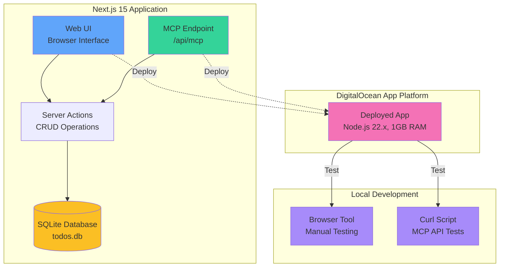

# Next.js 15 Todo App with MCP Integration

A modern, full-stack todo application built with Next.js 15, featuring Server Actions, SQLite database, and Model Context Protocol (MCP) endpoint integration for AI assistant access.

## 🏗️ Architecture



## ✨ Features

- ✅ **Modern UI**: Beautiful, responsive interface built with Tailwind CSS
- ✅ **Server Actions**: Next.js 15 Server Actions for seamless data mutations
- ✅ **SQLite Database**: Lightweight, persistent storage with better-sqlite3
- ✅ **MCP Endpoint**: AI-accessible interface for programmatic todo management via JSON-RPC 2.0
- ✅ **Real-time Updates**: Automatic revalidation after data changes
- ✅ **Type Safety**: Full TypeScript support throughout the application

## 🚀 Getting Started

### Prerequisites

- Node.js 22.x or later
- npm or yarn

### Installation

1. Clone the repository:
```bash
git clone https://github.com/YOUR_USERNAME/next15-todo-mcp.git
cd next15-todo-mcp
```

2. Install dependencies:
```bash
npm install
```

3. Run the development server:
```bash
npm run dev
```

4. Open [http://localhost:3000](http://localhost:3000) in your browser.

## 📁 Project Structure

```
next15-todo-mcp/
├── app/
│   ├── actions/
│   │   └── todos.ts          # Server Actions for CRUD operations
│   ├── api/
│   │   └── mcp/
│   │       └── route.ts      # MCP endpoint (V2)
│   ├── page.tsx              # Main todo list UI
│   └── layout.tsx            # Root layout
├── lib/
│   └── db.ts                 # SQLite database setup
├── tests/
│   └── mcp-api.sh            # Curl-based MCP endpoint tests (V3)
├── todos.db                  # SQLite database file
└── README.md
```

## 🎯 Usage

### Web Interface

1. **Add a task**: Type your task in the input field and click "Add Task"
2. **Complete a task**: Click the "Complete" button on any task
3. **Delete a task**: Click the "Delete" button to remove a task

### MCP Endpoint

The MCP endpoint provides programmatic access to todo operations for AI assistants via JSON-RPC 2.0 protocol at `/api/mcp`.

#### Available Tools

| Tool | Description | Parameters |
|------|-------------|------------|
| `ping` | Health check for MCP endpoint | None |
| `getTasks` | Retrieve all todo items | None |
| `addTask` | Create a new todo item | `title` (string) |
| `completeTask` | Mark a todo as completed | `id` (number) |
| `deleteTask` | Remove a todo item | `id` (number) |

#### Example Requests

**1. Health Check (Ping)**
```bash
curl -X POST http://localhost:3000/api/mcp \
  -H "Content-Type: application/json" \
  -d '{
    "jsonrpc": "2.0",
    "method": "tools/call",
    "params": {
      "name": "ping",
      "arguments": {}
    },
    "id": 1
  }'
```

**Response:**
```json
{
  "jsonrpc": "2.0",
  "id": 1,
  "result": {
    "content": [
      {
        "type": "text",
        "text": "✅ Pong from Next.js 15 To-Do MCP Server!"
      }
    ]
  }
}
```

**2. Get All Tasks**
```bash
curl -X POST http://localhost:3000/api/mcp \
  -H "Content-Type": application/json" \
  -d '{
    "jsonrpc": "2.0",
    "method": "tools/call",
    "params": {
      "name": "getTasks",
      "arguments": {}
    },
    "id": 2
  }'
```

**3. Add a New Task**
```bash
curl -X POST http://localhost:3000/api/mcp \
  -H "Content-Type: application/json" \
  -d '{
    "jsonrpc": "2.0",
    "method": "tools/call",
    "params": {
      "name": "addTask",
      "arguments": {
        "title": "Buy groceries"
      }
    },
    "id": 3
  }'
```

**4. Complete a Task**
```bash
curl -X POST http://localhost:3000/api/mcp \
  -H "Content-Type: application/json" \
  -d '{
    "jsonrpc": "2.0",
    "method": "tools/call",
    "params": {
      "name": "completeTask",
      "arguments": {
        "id": 1
      }
    },
    "id": 4
  }'
```

**5. Delete a Task**
```bash
curl -X POST http://localhost:3000/api/mcp \
  -H "Content-Type: application/json" \
  -d '{
    "jsonrpc": "2.0",
    "method": "tools/call",
    "params": {
      "name": "deleteTask",
      "arguments": {
        "id": 1
      }
    },
    "id": 5
  }'
```

**List Available Tools:**
```bash
curl -X POST http://localhost:3000/api/mcp \
  -H "Content-Type: application/json" \
  -d '{
    "jsonrpc": "2.0",
    "method": "tools/list",
    "params": {},
    "id": 6
  }'
```

## 🧪 Testing

### Manual Testing (Browser UI)
Open [http://localhost:3000](http://localhost:3000) in your browser to interact with the web UI.

### Automated Testing (Curl - V3)

A comprehensive curl-based test script validates the MCP endpoint against all 5 tools and JSON-RPC 2.0 protocol compliance:

**Run tests locally:**
```bash
# Start dev server in one terminal
npm run dev

# In another terminal, run tests
./tests/mcp-api.sh

# Or specify a different base URL
./tests/mcp-api.sh https://your-production-url.com
```

**Test Coverage:**
- ✅ List all available tools (`tools/list`)
- ✅ Verify all 5 tools exist (ping, getTasks, addTask, completeTask, deleteTask)
- ✅ Ping tool (health check)
- ✅ Get all tasks
- ✅ Add new task
- ✅ Add task with empty title (error handling)
- ✅ Complete task
- ✅ Delete task
- ✅ Invalid tool name (error handling)
- ✅ JSON-RPC 2.0 format compliance
- ✅ Concurrent request handling

**Test Results Example:**
```
==========================================
MCP Endpoint Test Suite
==========================================
Passed: 12
Failed: 0
Total: 12

✓ All tests passed!
```

## 🚢 Deployment

This application is deployed on DigitalOcean App Platform with:

- **Runtime**: Node.js 22.x
- **Instance**: Basic Shared CPU (1GB RAM)
- **Build Command**: `npm run build`
- **Run Command**: `npm start`
- **Auto-deploy**: Enabled from GitHub main branch

### Deploy Your Own

1. Fork this repository
2. Create a new app on [DigitalOcean App Platform](https://cloud.digitalocean.com/apps)
3. Connect your GitHub repository
4. Configure the build and run commands as shown above
5. Deploy!

## 📊 Development Roadmap

### ✅ V1 - Basic Todo App (Completed)
- Next.js 15 setup
- Server Actions for CRUD
- SQLite database
- Modern UI with Tailwind
- Deployed to DigitalOcean App Platform

### ✅ V2 - MCP Integration (Current)
- MCP endpoint implementation ✅
- 5 tools for todo management ✅
- MCP protocol compliance (JSON-RPC 2.0) ✅
- Comprehensive API documentation ✅

### 📋 V3 - Automated Testing (Next)
- Curl-based MCP endpoint test script
- JSON-RPC 2.0 protocol validation
- Integration testing across all tools
- Test coverage: 12 comprehensive tests

## 🛠️ Tech Stack

- **Framework**: [Next.js 15](https://nextjs.org/)
- **Language**: [TypeScript](https://www.typescriptlang.org/)
- **Database**: [SQLite](https://www.sqlite.org/) with [better-sqlite3](https://github.com/WiseLibs/better-sqlite3)
- **Styling**: [Tailwind CSS](https://tailwindcss.com/)
- **MCP Protocol**: JSON-RPC 2.0 implementation
- **Testing**: Curl-based API tests (shell script)
- **Deployment**: [DigitalOcean App Platform](https://www.digitalocean.com/products/app-platform)

## 📝 License

MIT

## 🤝 Contributing

Contributions are welcome! Please feel free to submit a Pull Request.

---

Built with ❤️ using Next.js 15 and MCP
